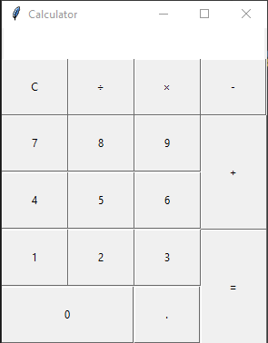

# Simple Calculator

A simple calculator built with Python and Tkinter

## Table of contents

* [General Info](#general-information)
* [Technologies Used](#technologies-used)
* [Screenshots](#screenshots)
* [Setup](#setup)
* [Project Status](#project-status)
* [Contact](#contact)

## General Information

A simple calculator built with Python and Tkinter, just does simple arithmetic :)

## Technologies Used

* Python 3.10.0
* Tkinter

## Screenshots

## Setup

`pip install tk`

## Project Status

Project is: _finished_

## Contact

[Check out my GitHub](https://github.com/ethan-pt)

[Send me an Email](mailto:tubbeethan@gmail.com)
